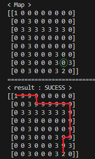
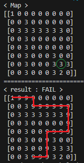

# Astar-algorithm-study
A* algorithm study

## Requirements
- Python 3.x
- numpy


## Usage
1. **Run the A* algorithm:**
    ```bash
    python main.py
    ```

2. **Check the results:**
   The result can be visualized as shown in the screenshot below.
   
   * 1 : start point
   * 2 : finish point
   * 3 : wall
   * 9 : path

   | SUCCESS | FAIL |
   |:--------:|:------------:|
   |  |  |
   
3. **Customize the Map:**
   Customize your map by modifying the `my_map` method in the `GridMap` class in `map.py`.

